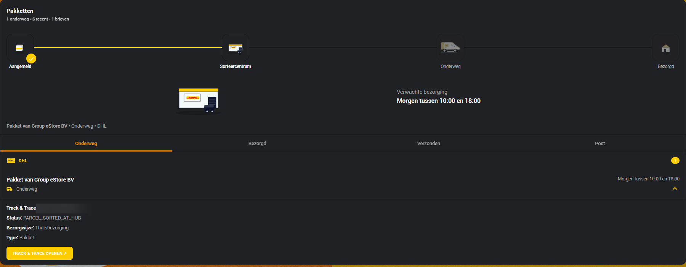
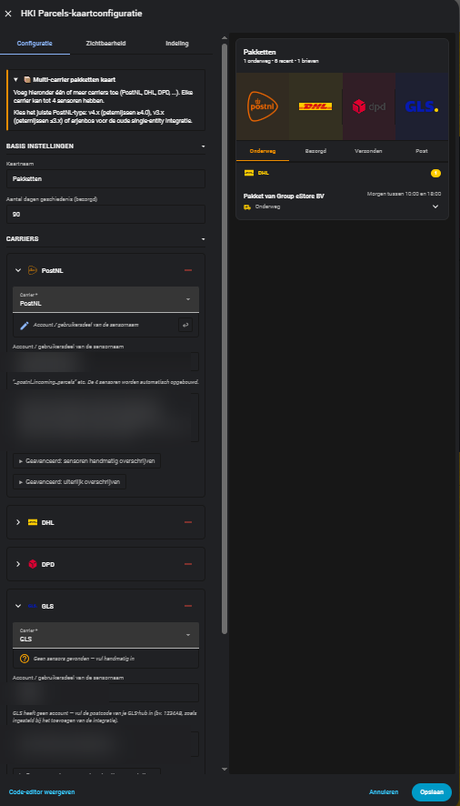
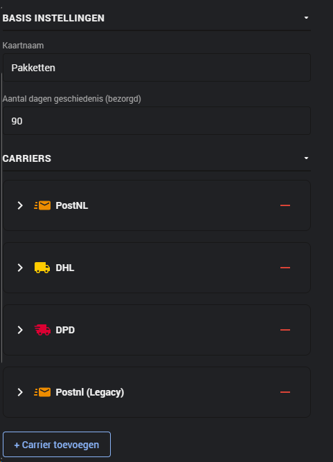

# HKI Parcels Card

A Home Assistant Lovelace card for tracking parcels from multiple carriers (PostNL, DHL, DPD) in a single unified view.

> **Based on** [jimz011/hki-elements](https://github.com/jimz011/hki-elements) — the original PostNL card from the HKI project. This fork has been extended with multi-carrier support, automatic sensor templating, and letterbox mail display.

---

## Screenshots

### Dashboard — multiple carriers



### Visual editor with live preview



### Carrier configuration



---

## Required integrations

This card reads data from Home Assistant sensor entities created by the integrations below. **Install the integrations for the carriers you use before configuring the card.**

| Carrier | Integration | Schema |
|---|---|---|
| **PostNL** | [peternijssen/ha-postnl](https://github.com/peternijssen/ha-postnl) | `legacy` (v3.x) · `canonical` (v4.0.0+) |
| **DHL** | [peternijssen/ha-dhl-nl](https://github.com/peternijssen/ha-dhl-nl) | `canonical` |
| **DPD** | [peternijssen/ha-dpd](https://github.com/peternijssen/ha-dpd) | `canonical` |

> **PostNL v4.0.0:** The ha-postnl integration is being updated to v4.0.0, aligning its sensors and attributes with DHL and DPD. When using v4.0.0 or later, set `schema: canonical` in your card configuration.

---

## PostNL Legacy — no further updates

The card includes a **PostNL (Legacy)** mode based on the [arjenbos/ha-postnl](https://github.com/arjenbos/ha-postnl) integration. **This mode will not receive further updates as long as that repository is not actively maintained.** Use the standard PostNL option (peternijssen/ha-postnl) for new installations.

---

## Installation

### Via HACS (recommended)

1. In Home Assistant go to **HACS → Dashboard → Custom repositories**
2. Add `https://github.com/jonisnet/hki-parcels-card` as category **Dashboard**
3. Search for **HKI Parcels Card** and install
4. Restart Home Assistant or clear your browser cache

### Manual

1. Download `hki-parcels-card.js` from this repository
2. Place the file at `/config/www/hki-parcels-card.js`
3. Go to **Settings → Dashboards → Resources** and add:
   ```
   /local/hki-parcels-card.js
   ```
   (Type: JavaScript module)
4. Clear your browser cache (Ctrl+Shift+R)

---

## Configuration

### Minimal configuration (single carrier)

```yaml
type: custom:hki-parcels-card
title: My Parcels
carriers:
  - type: dhl
    user: my_account
```

The `user` field is the part of your sensor name before `_dhl_incoming_parcels`. The card builds the sensor names automatically.

### Multiple carriers

```yaml
type: custom:hki-parcels-card
title: Parcels
carriers:
  - type: postnl
    user: your_name
  - type: dhl
    user: your_name
  - type: dpd
    user: your_name
```

### All options

```yaml
type: custom:hki-parcels-card
title: Parcels
days_back: 90               # How many days to show delivered parcels
show_delivered: true        # Show "Delivered" tab
show_sent: true             # Show "Sent" tab
show_letters: true          # Show "Letters" tab (PostNL letterbox mail)
show_animation: true        # Show animation block when a parcel is selected
show_header: true           # Show header with title and statistics
show_placeholder: true      # Show background image
header_color: ''            # Header background color
header_text_color: ''       # Header text color
placeholder_image: ''       # URL to a custom background image
layout_order:               # Order of the blocks
  - header
  - animation
  - tabs
  - list
carriers:
  - type: postnl            # postnl · dhl · dpd · postnl_legacy · custom
    user: your_name         # Account part of the sensor name
    # Optional appearance overrides:
    name: PostNL
    icon: mdi:package-variant-closed
    color: '#ed8c00'
    logo_path: ''
    van_path: ''
    banner_path: ''
    # Override sensors manually (normally not needed):
    entity_incoming: sensor.your_name_postnl_incoming_parcels
    entity_delivered: sensor.your_name_postnl_delivered_parcels
    entity_outgoing: sensor.your_name_postnl_outgoing_parcels
    entity_letters: sensor.your_name_postnl_letters
```

### PostNL (Legacy) — arjenbos/ha-postnl

```yaml
carriers:
  - type: postnl_legacy
    entity: sensor.postnl_delivery
    distribution_entity: sensor.postnl_distribution   # optional
```

> **Note:** this mode will not receive further updates as long as [arjenbos/ha-postnl](https://github.com/arjenbos/ha-postnl) is not actively maintained.

---

## Sensor schemas

| Schema | When to use |
|---|---|
| `legacy` | PostNL via peternijssen/ha-postnl v3.x (current default) |
| `canonical` | DHL, DPD, and PostNL v4.0.0+ |
| `single_entity` | PostNL via arjenbos/ha-postnl (set automatically for type `postnl_legacy`) |

---

## Features

- **Multi-carrier** — PostNL, DHL and DPD side by side in one card
- **Automatic sensor names** — enter only the account part, the rest is built automatically
- **Tabs** — In Transit / Delivered / Sent / Letters
- **Parcel details** — click a parcel for tracking number, delivery method and direct tracking link
- **Letterbox mail** — PostNL letters with scan images from `image.*` entities
- **Animation** — vehicle animation for the selected parcel
- **Customisable appearance** — custom logo, GIF, banner and colours per carrier

---

## Attribute support per schema

| Attribute | canonical (DHL/DPD/PostNL v4+) | legacy (PostNL v3) |
|---|---|---|
| `barcode` | ✅ | ✅ |
| `sender` | ✅ | ✅ |
| `status` (enum) | ✅ | — (free text) |
| `raw_status` | ✅ | ✅ |
| `delivered` (bool) | ✅ | derived from status text |
| `delivered_at` | ✅ | — |
| `planned_from` / `planned_to` | ✅ | `delivery_date` |
| `pickup` / `pickup_point` | ✅ | — |
| `url` | ✅ | ✅ |

---

## License

See the [LICENSE](LICENSE) file.

---

## Credits

- [jimz011/hki-elements](https://github.com/jimz011/hki-elements) — original PostNL card and visual design this fork is based on
- [peternijssen/ha-postnl](https://github.com/peternijssen/ha-postnl) — PostNL integration
- [peternijssen/ha-dhl-nl](https://github.com/peternijssen/ha-dhl-nl) — DHL integration
- [peternijssen/ha-dpd](https://github.com/peternijssen/ha-dpd) — DPD integration
- [arjenbos/ha-postnl](https://github.com/arjenbos/ha-postnl) — legacy PostNL integration
